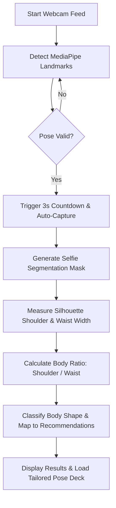

# 🧍 PoseGuide: AI-Powered Body Shape Analyzer & Pose Recommender

PoseGuide is a real-time computer vision and machine learning application that detects a user's pose, extracts their physical silhouette, classifies their body shape, and recommends personalized modeling and fashion poses tailored specifically to their body type. 

By leveraging **MediaPipe Pose**, **MediaPipe Selfie Segmentation**, and **OpenCV**, the application automates pose validation, body ratio calculation, and style recommendation directly from a live webcam feed.

---

## 🚀 Key Features

* **📷 Real-Time Pose Validation**: Ensures the user is standing straight, facing the camera, and remaining stable before initiating analysis.
* **⏱️ Auto-Capture Countdown**: Detects a stable pose and triggers a 3-second visual countdown to automatically capture the silhouette.
* **👤 Silhouette-Based Width Extraction**: Uses selfie segmentation to generate a precise binary mask and scans horizontal lines at key anatomical heights to determine exact physical width.
* **📊 Accurate Body Ratio Calculation**: Automatically calculates the ratio between shoulder width and waist width.
* **🧠 Body Shape Classification**: Uses empirical mathematical profiles to classify the user's body into one of five standard body shapes:
  * 🟢 **Oval** (Ideal Ratio ~`0.70`)
  * 🟡 **Triangle** (Ideal Ratio ~`0.85`)
  * 🔵 **Rectangle** (Ideal Ratio ~`1.00`)
  * 🟣 **Trapezium** (Ideal Ratio ~`1.12`)
  * 🔴 **Inverted Triangle** (Ideal Ratio ~`1.30`)
* **💃 Tailored Pose Recommendations**: Dynamically loads and displays professional fashion/modeling poses matching the user's classified body shape to inspire better photography and style.

---

## 🛠️ Tech Stack

* **Language**: Python 3.8+
* **Computer Vision & Tracking**: 
  * [OpenCV](https://opencv.org/) (Image processing & GUI)
  * [MediaPipe Pose](https://google.github.io/mediapipe/solutions/pose.html) (Anatomical landmarks)
  * [MediaPipe Selfie Segmentation](https://google.github.io/mediapipe/solutions/selfie_segmentation.html) (Silhouette extraction)
* **Data Processing**: NumPy, Math, Glob

---

## 📁 Repository Structure

```filepath
├── Poses/                     # Recommended pose datasets (images)
│   ├── inverted_triangle/
│   ├── oval/
│   ├── rectangle/
│   ├── trapezium/
│   └── triangle/
├── src/
│   └── pose_detector.py       # Core PoseDetector class (Tracking & Classification)
├── main.py                    # Main app loop, live webcam processing & GUI
├── requirements.txt           # Project dependencies
├── silhouette_data.csv        # Log of empirical body width and ratio readings
└── README.md                  # Project documentation (this file)
```

---

## ⚙️ How It Works (Under the Hood)



1. **Anatomical Alignment Checks**:
   * **Full Body Detection**: Verifies that shoulders, hips, and ankles are fully visible.
   * **Shoulder/Hip Balance**: Computes Y-axis alignment delta between left and right landmarks.
   * **Motion Stability**: Checks X/Y coordinates of the body's center against preceding frames to ensure the user is standing still.
2. **Silhouette Width Extraction**:
   * Calculates the body center on the X-axis.
   * Generates a binary silhouette mask where the user is `255` (white) and the background is `0` (black).
   * Determines **Shoulder Width** at shoulder level (`shoulder_y + 20px`).
   * Determines **Waist Width** at `waist_y` (calculated at 35% of the distance from shoulders to hips).
   * Measures width by scanning horizontally outwards from the body center to find mask edges.
3. **Shape Mapping**:
   * Compares the calculated ratio against ideal shape profiles (Oval, Triangle, Rectangle, Trapezium, Inverted Triangle) using nearest distance calculation.

---

## 🚀 Getting Started

### 📋 Prerequisites

Ensure you have Python 3.8 or higher installed.

### 📥 Installation

1. **Clone the repository**:
   ```bash
   git clone https://github.com/satyamkumar04321/pose-guided.git
   cd pose-guided
   ```

2. **Create and activate a virtual environment** (optional but recommended):
   ```bash
   python -m venv venv
   # On Windows:
   venv\Scripts\activate
   # On macOS/Linux:
   source venv/bin/activate
   ```

3. **Install dependencies**:
   ```bash
   pip install -r requirements.txt
   ```

### 🎮 Running the Application

Launch the live webcam interface:
```bash
python main.py
```

### ⌨️ Keyboard Controls
* **`R`**: Reset the capture state and start a new live analysis.
* **`Q`**: Quit the application and close all windows safely.

---

## 📄 License

This project is licensed under the MIT License - see the LICENSE file for details.
